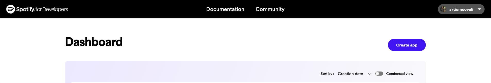
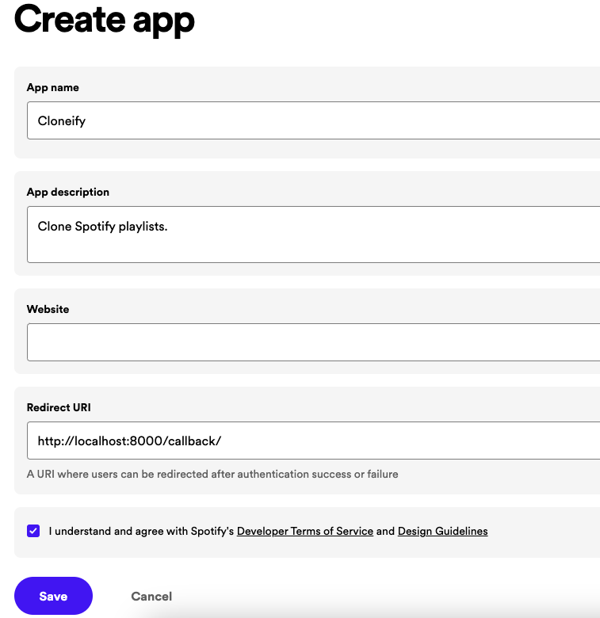

# Cloneify - Clone Spotify Playlists

Made using the Spotify API, Spotipy, and tkinter

#### Generate an API Key from Spotify Dashboard


If you want to use Spotify's API to create applications that interact with
their music streaming service, you will need an API key. Here's how you can
generate one from the Spotify Dashboard:

1. Go to the [Spotify Developer Dashboard](https://developer.spotify.com/dashboard/)
and log in with your Spotify account credentials.

2. Click on the "Create an App" button to create a new application.

   

3. Give your application a name and description, and agree to the terms of
   service. In the `Redirect URI` section add `http://localhost:8000/callback`
   as a callback URL. This is necessary for the OAuth 2.0 authentication flow
   to work. Click on "Create" to proceed. 

4. On the next page, you'll see the details of your newly created application.
   In the Settings Look for the section labeled "Client ID" and click on the
   "Show Client Secret" button. You will now see your Client ID and Client
   Secret. You will need both of these to use the Spotify API.

#### Adding permanent environment variables

1. Set the following environment variables from the credentials you generated.

```zsh
# Add this to ~/.zshrc (or your $SHELL equivalent)
echo "export SPOTIPY_CLIENT_ID=[YOUR CLIENT ID]" >> ~/.zshrc
echo "export SPOTIPY_CLIENT_SECRET=[YOUR CLIENT SECRET]" >> ~/.zshrc
echo "export SPOTIPY_REDIRECT_URI=http://localhost:8000/callback/" >> ~/.zshrc
```
